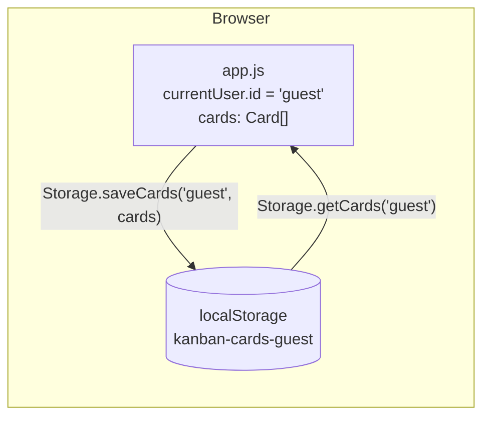
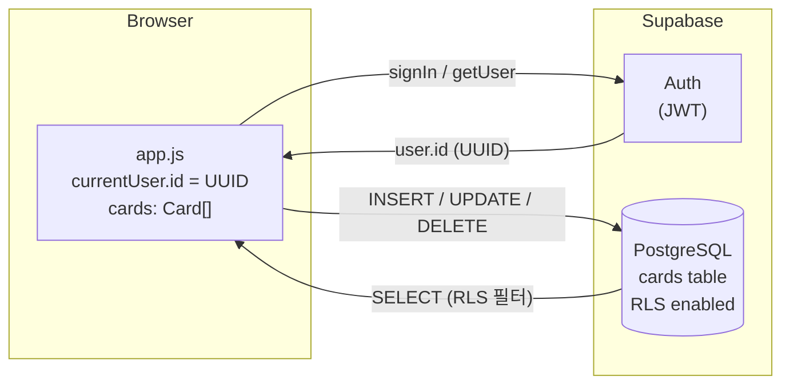

# Database Design
## Kanban Board

---

## 1. 스토리지 전략 개요

| 버전 | 스토리지 | 사용자 격리 방식 |
|------|---------|----------------|
| v1 (현재) | 브라우저 `localStorage` | 키 이름에 `userId` 포함 (`kanban-cards-{userId}`) |
| v2 (예정) | Supabase PostgreSQL | `cards.user_id` 컬럼 + Row Level Security |

> 데이터 모델(Card 객체)은 v1부터 `user_id` 필드를 포함해 v2 마이그레이션 시 스키마 변경 없이 데이터를 그대로 이전할 수 있도록 설계한다.

---

## 2. 데이터 모델

### 2.1 Card 객체

| 필드 | 타입 | 설명 | v1 값 | v2 값 |
|------|------|------|-------|-------|
| `id` | `string` | 고유 식별자 | `uid()` 생성 (`timestamp-random`) | 동일 (TEXT PK) |
| `user_id` | `string` | 소유 사용자 ID | `'guest'` (고정) | Supabase `auth.uid()` (UUID) |
| `text` | `string` | 카드 본문 텍스트 | 사용자 입력 | 동일 |
| `col` | `'todo' \| 'in-progress' \| 'done'` | 소속 컬럼 | 상태값 | CHECK 제약 |

### 2.2 저장 예시 (v1 localStorage)

```json
[
  { "id": "1715612345678-abc12", "user_id": "guest", "text": "README 작성",    "col": "todo" },
  { "id": "1715612345679-def34", "user_id": "guest", "text": "기능 명세 정리", "col": "in-progress" },
  { "id": "1715612345680-ghi56", "user_id": "guest", "text": "환경 세팅",      "col": "done" }
]
```

---

## 3. v1 — localStorage 스키마

### 3.1 키 목록

| 키 패턴 | 타입 | 설명 | 기본값 |
|---------|------|------|--------|
| `kanban-cards-{userId}` | `JSON string` (Card[]) | 사용자별 카드 목록 | `[]` → 샘플 삽입 |
| `kanban-theme` | `'light'` \| `'dark'` | 테마 (브라우저 전역) | OS 다크모드 감지 |

> v1에서 `userId = 'guest'` 고정이므로 실제 키는 **`kanban-cards-guest`**.
> v2 전환 후 Supabase UUID 기반 키는 더 이상 사용하지 않으며, DB로 마이그레이션한다.

### 3.2 CRUD 연산

| 연산 | 구현 |
|------|------|
| **Read** | `JSON.parse(localStorage.getItem('kanban-cards-guest') \|\| '[]')` |
| **Create** | 배열에 Card 객체 push → JSON.stringify → setItem |
| **Update** | 배열에서 id로 찾아 `col` 변경 → JSON.stringify → setItem |
| **Delete** | 배열에서 id로 splice → JSON.stringify → setItem |

---

## 4. v2 예정 — Supabase 테이블 스키마

### 4.1 `cards` 테이블

```sql
CREATE TABLE cards (
  id         TEXT        PRIMARY KEY,
  user_id    UUID        NOT NULL REFERENCES auth.users(id) ON DELETE CASCADE,
  text       TEXT        NOT NULL,
  col        TEXT        NOT NULL CHECK (col IN ('todo', 'in-progress', 'done')),
  created_at TIMESTAMPTZ NOT NULL DEFAULT NOW(),
  updated_at TIMESTAMPTZ NOT NULL DEFAULT NOW()
);

CREATE INDEX idx_cards_user_id ON cards(user_id);
```

### 4.2 Row Level Security (RLS)

```sql
ALTER TABLE cards ENABLE ROW LEVEL SECURITY;

-- 자신의 카드만 읽기
CREATE POLICY "select own cards"
  ON cards FOR SELECT
  USING (auth.uid() = user_id);

-- 자신의 카드만 생성 (user_id 강제 설정)
CREATE POLICY "insert own cards"
  ON cards FOR INSERT
  WITH CHECK (auth.uid() = user_id);

-- 자신의 카드만 수정
CREATE POLICY "update own cards"
  ON cards FOR UPDATE
  USING (auth.uid() = user_id);

-- 자신의 카드만 삭제
CREATE POLICY "delete own cards"
  ON cards FOR DELETE
  USING (auth.uid() = user_id);
```

### 4.3 updated_at 자동 갱신 트리거

```sql
CREATE OR REPLACE FUNCTION update_updated_at()
RETURNS TRIGGER AS $$
BEGIN
  NEW.updated_at = NOW();
  RETURN NEW;
END;
$$ LANGUAGE plpgsql;

CREATE TRIGGER trg_cards_updated_at
  BEFORE UPDATE ON cards
  FOR EACH ROW EXECUTE FUNCTION update_updated_at();
```

### 4.4 CRUD 연산 (v2 Supabase JS)

| 연산 | Supabase 코드 |
|------|--------------|
| **Read** | `supabase.from('cards').select('*').eq('user_id', userId)` |
| **Create** | `supabase.from('cards').insert({ id, user_id, text, col })` |
| **Update** | `supabase.from('cards').update({ col }).eq('id', id)` |
| **Delete** | `supabase.from('cards').delete().eq('id', id)` |

---

## 5. ID 생성 전략

```js
function uid() {
  return `${Date.now()}-${Math.random().toString(36).slice(2)}`;
}
```

- v1에서 이 함수로 생성한 ID를 그대로 Supabase TEXT PK로 사용 가능.
- Supabase의 `uuid_generate_v4()`로 교체해도 무방하나, TEXT PK를 유지하면 마이그레이션 데이터 호환성이 보장된다.

---

## 6. v1 → v2 마이그레이션 경로

```
1. Supabase 프로젝트 생성 + Auth 활성화
2. cards 테이블 생성 + RLS 정책 적용 (위 SQL 실행)
3. app.js의 Storage 객체를 Supabase 클라이언트 호출로 교체
4. initUser()를 supabase.auth.getUser() 기반으로 교체
5. (선택) localStorage 기존 데이터를 Supabase로 일괄 INSERT하는 마이그레이션 스크립트 실행
```

localStorage 데이터 → Supabase 변환 예시:
```js
// 기존 localStorage 데이터를 Supabase로 이전할 때
const localCards = JSON.parse(localStorage.getItem('kanban-cards-guest') || '[]');
const { data: { user } } = await supabase.auth.getUser();
const toInsert = localCards.map(c => ({ ...c, user_id: user.id }));
await supabase.from('cards').insert(toInsert);
localStorage.removeItem('kanban-cards-guest');
```

---

## 7. 데이터 흐름 다이어그램

### v1



### v2 (예정)


