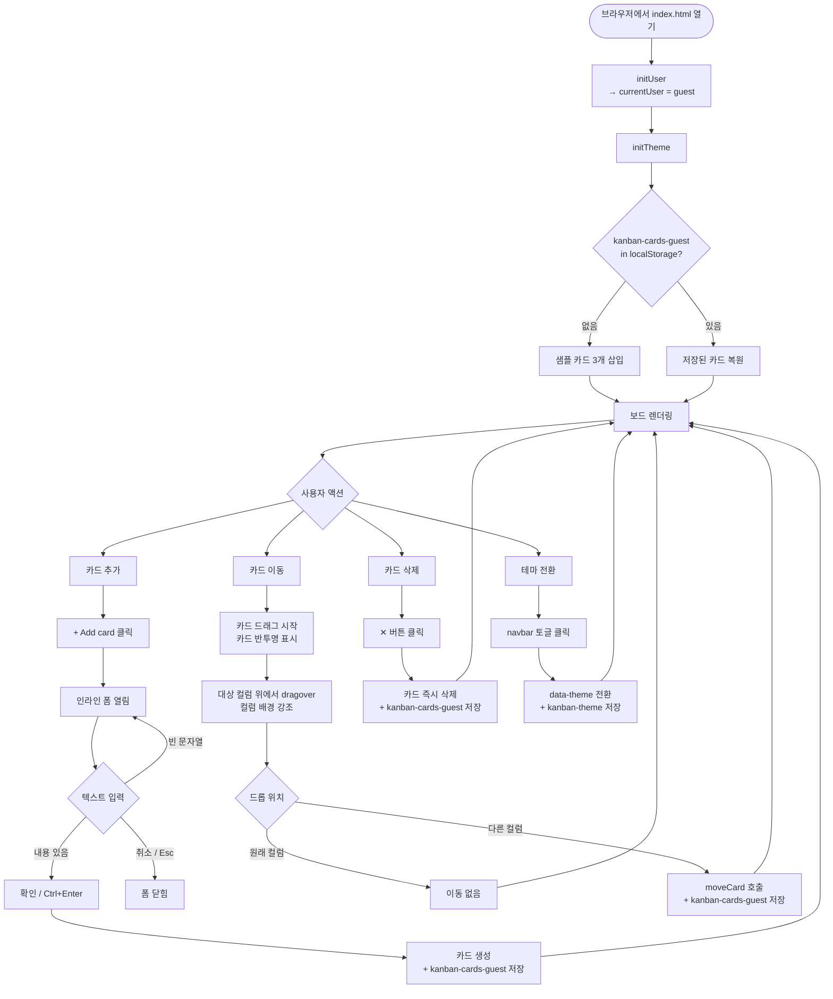
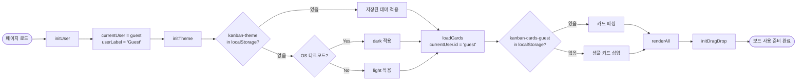
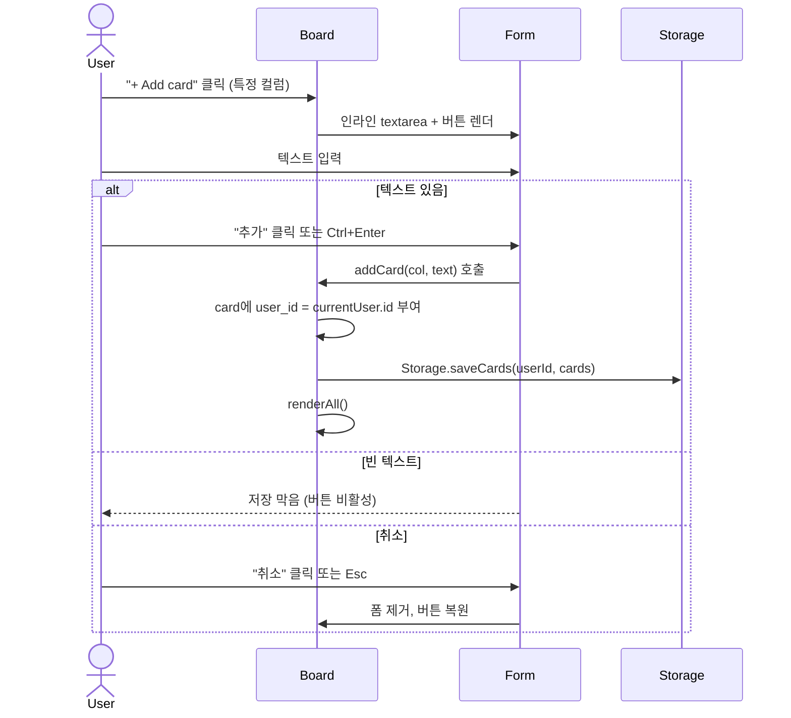
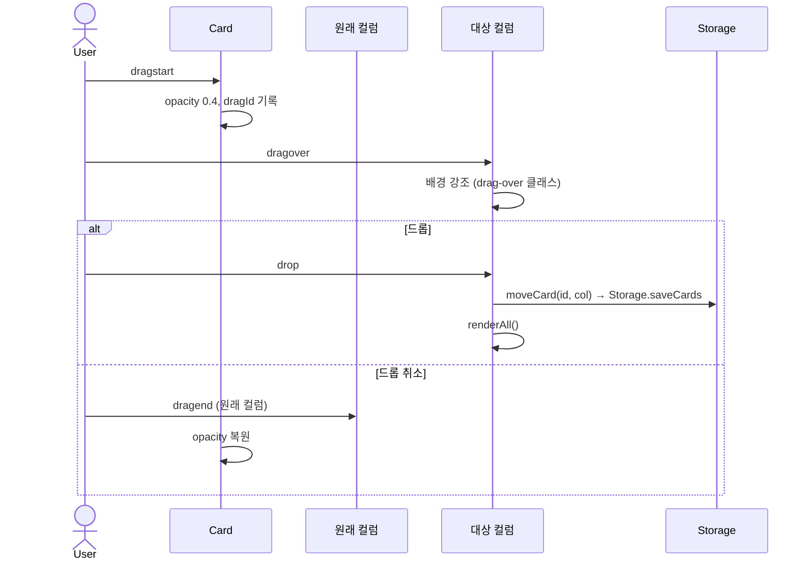
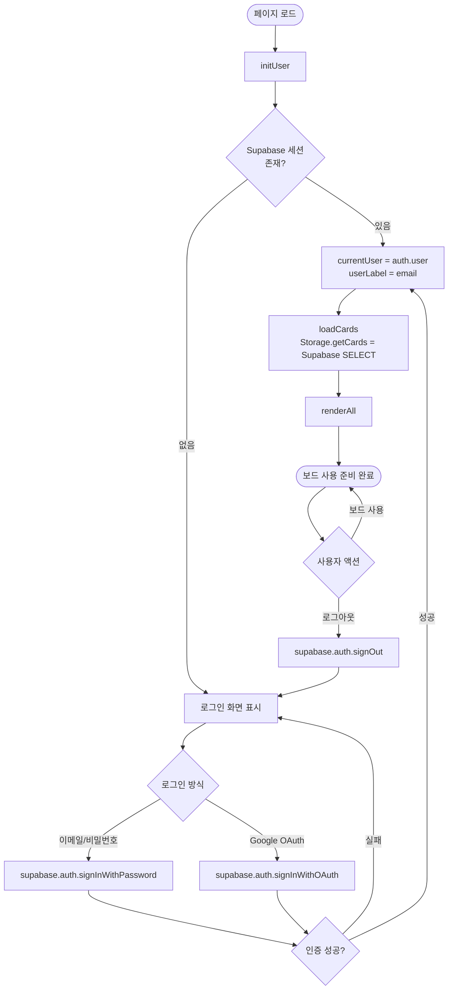
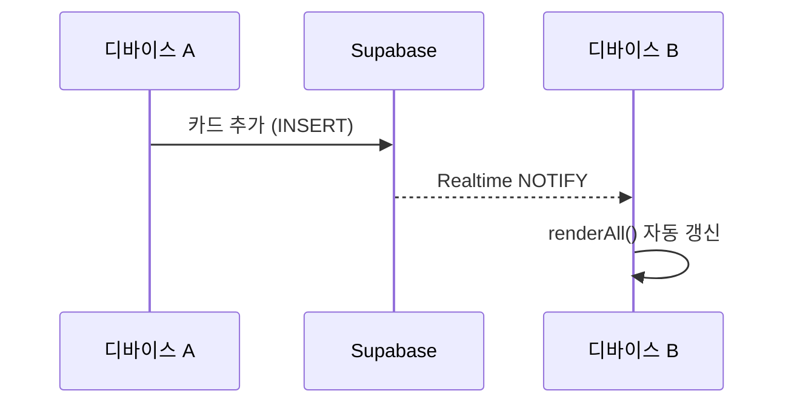

# User Flow — 사용자 흐름도
## Kanban Board

> v1: 게스트 사용자 단독 지원. v2 인증 흐름은 별도 섹션에 설계만 기술한다.

---

## 1. 전체 여정 개요 (v1 — 게스트)

---

## 2. 초기 로드 상세 흐름 (v1)

---

## 3. 카드 추가 상세 흐름

---

## 4. 드래그 앤 드롭 상세 흐름

---

## 5. v2 예정 — 인증 흐름 (Supabase Auth)

> 현재 미구현. 구조 설계 목적으로 기술한다.

---

## 6. v2 예정 — 멀티 디바이스 실시간 동기화

